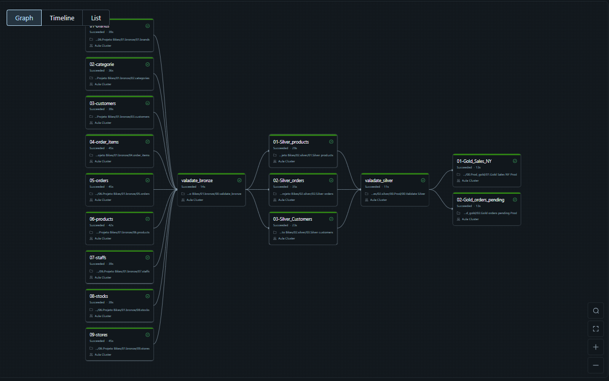
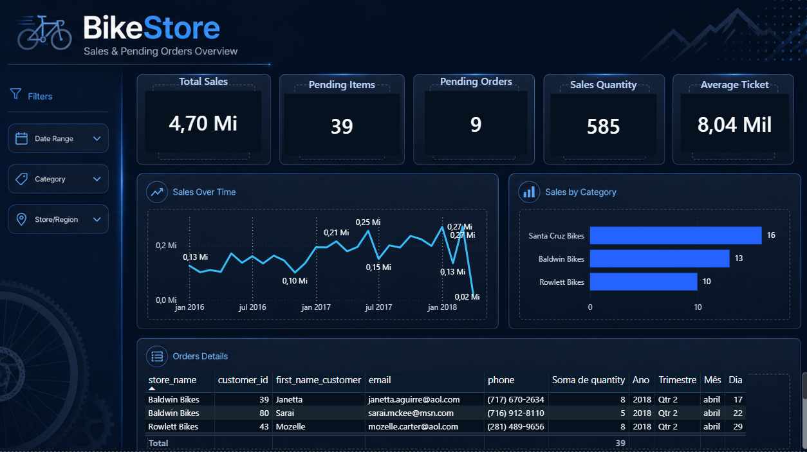

# 🚴 BikeStore — Pipeline de Engenharia de Dados de Ponta a Ponta


## 📌 Sobre o Projeto

Pipeline de engenharia de dados completo desenvolvido no **Azure Databricks**, seguindo a **Medallion Architecture** (Bronze → Silver → Gold). O projeto utiliza um dataset de uma rede de lojas de bicicletas e entrega dashboards analíticos com KPIs de vendas, pedidos e clientes.

O objetivo foi aplicar boas práticas de ETL em ambiente de nuvem, garantindo qualidade, rastreabilidade e segurança em cada camada do pipeline.

---

## 🏗️ Arquitetura

```
Fonte de Dados
      │
      ▼
┌─────────────┐
│   BRONZE    │  ← Ingestão dos dados brutos (raw)
│  (Raw Data) │
└──────┬──────┘
       │
       ▼
┌─────────────┐
│   SILVER    │  ← Limpeza, validação e padronização
│ (Cleansed)  │
└──────┬──────┘
       │
       ▼
┌─────────────┐
│    GOLD     │  ← Dados prontos para consumo analítico
│  (Curated)  │
└──────┬──────┘
       │
       ▼
   Dashboard
  (Power BI)
```

### Pipeline no Databricks



---

## 🗂️ Estrutura do Projeto

```
BikeStore-Pipeline/
│
├── 01.bronze/
│   ├── 01.brands.py
│   ├── 02.categories.py
│   ├── 03.customers.py
│   ├── 04.order_items.py
│   ├── 05.orders.py
│   ├── 06.products.py
│   ├── 07.staffs.py
│   ├── 08.stocks.py
│   ├── 09.stores.py
│   └── 00.validate_bronze.py
│
├── 02.silver/
│   ├── 01.Silver_products.py
│   ├── 02.Silver_orders.py
│   ├── 03.Silver_customers.py
│   └── 00.Validate_Silver.py
│
├── 03.gold/
│   ├── 01.Gold_Sales_NY.py
│   └── 02.Gold_orders_pending.py
│
└── README.md
```

---

## ⚙️ Camadas do Pipeline

### 🥉 Bronze — Raw Data
- Ingestão dos dados brutos diretamente da fonte
- Dados preservados sem transformação, garantindo rastreabilidade
- 9 entidades carregadas: `brands`, `categories`, `customers`, `order_items`, `orders`, `products`, `staffs`, `stocks`, `stores`
- Validação de integridade ao final da carga (`validate_bronze`)

### 🥈 Silver — Cleansed & Standardized
- Limpeza e padronização dos dados com **PySpark e SQL**
- Remoção de duplicatas, tratamento de nulos e padronização de tipos
- Tabelas geradas: `Silver_products`, `Silver_orders`, `Silver_customers`
- Validação de qualidade ao final (`Validate_Silver`)

### 🥇 Gold — Curated & Analytics-Ready
- Dados refinados e modelados para consumo analítico
- Aplicação das regras de negócio para geração de métricas
- Tabelas geradas:
  - `Gold_Sales_NY` — análise de vendas por região (Nova York)
  - `Gold_orders_pending` — pedidos pendentes para acompanhamento operacional

---

## 📊 Dashboard — BikeStore Sales & Pending Orders

O pipeline alimenta um dashboard com os seguintes KPIs:

| Métrica | Descrição |
|---|---|
| **Total Vendas** | Receita total do período (4,70 Mi) |
| **Itens Pendentes** | Quantidade de itens aguardando envio |
| **Pedidos Pendentes** | Número de pedidos em aberto |
| **Qtd Vendas** | Total de vendas realizadas |
| **Ticket Médio** | Valor médio por pedido |

Visualizações disponíveis:
- 📈 Vendas ao longo do tempo (2016–2018)
- 📊 Vendas por categoria/loja
- 📋 Detalhamento de pedidos com dados do cliente



---

## 🛠️ Stack Tecnológica

| Tecnologia | Uso |
|---|---|
| **Azure Databricks** | Plataforma de processamento distribuído |
| **Apache Spark / PySpark** | Transformações e processamento dos dados |
| **Python** | Scripts de ingestão e orquestração |
| **SQL** | Consultas e validações nas camadas |
| **Delta Lake** | Formato de armazenamento com suporte a ACID |
| **Azure Data Lake Storage** | Armazenamento das camadas Bronze/Silver/Gold |

---

## 🚀 Como Executar

### Pré-requisitos
- Conta ativa no **Azure**
- Workspace do **Azure Databricks** configurado
- Cluster com suporte a **Spark 3.x** e **Python 3.x**
- Armazenamento configurado no **Azure Data Lake Storage Gen2**

### Passos

1. Clone o repositório:
```bash
git clone https://github.com/guilherme-silvam/bikestrore-pipelinedados.git
```

2. Importe os notebooks para o seu workspace do Databricks

3. Configure as credenciais de acesso ao Azure Data Lake no Databricks (via Secrets ou mount point)

4. Execute os notebooks na seguinte ordem:
```
01.bronze/ → 00.validate_bronze → 02.silver/ → 00.Validate_Silver → 03.gold/
```

---

## 📚 Conceitos Aplicados

- **Medallion Architecture** (Bronze / Silver / Gold)
- **ETL / ELT** em ambiente de nuvem
- **Processamento distribuído** com Apache Spark
- **Qualidade de dados** com camadas de validação
- **Governança e rastreabilidade** dos dados
- **Modelagem orientada ao negócio** na camada Gold

---

## 👤 Autor

Feito com por **Guilherme Machado Dev**

[](https://www.linkedin.com/in/guilherme-machado-b26327248/)
[](https://github.com/guilherme-silvam)
